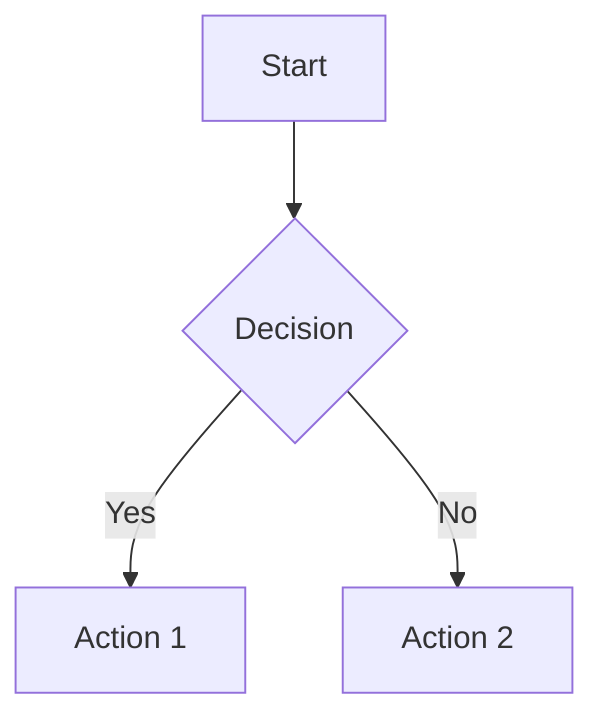

# md2pdf-server

Lightweight Markdown-to-PDF converter designed for server environments.

## When to Use This Skill

- User provides a `.md` file and requests PDF output
- Document contains KaTeX math expressions (`$...$` or `$$...$$`)
- Document contains Mermaid diagrams (`mermaid` code blocks)
- Running in Docker, VPS, or CI/CD without system browser installation

## Quick Start

```bash
cd md2pdf-server/scripts
./install.sh
python3 md2pdf.py input.md output.pdf
```

## Architecture

```
Markdown → markdown-it + markdown-it-katex → HTML (math pre-rendered)
         → Playwright + headless-shell → Mermaid rendered → PDF
```

- **KaTeX**: Server-side rendered (Node.js) for accuracy and performance
- **Mermaid**: Browser-rendered via Playwright for complex layout
- **Zero system dependencies**: Bundles Chromium headless-shell

## Usage from Codex

```python
import subprocess

result = subprocess.run([
    'python3', 'skills/md2pdf-server/scripts/md2pdf.py',
    'input.md', 'output.pdf'
], capture_output=True, text=True)

if result.returncode == 0:
    print("PDF generated successfully")
else:
    print(f"Error: {result.stderr}")
```

## Supported Syntax

### KaTeX Math

Inline: `$E = mc^2$`

Block:
```
$$
\int_{-\infty}^{\infty} e^{-x^2} dx = \sqrt{\pi}
$$
```

### Mermaid Diagrams



## Installation

### Automatic

```bash
cd scripts
./install.sh
```

### Manual

```bash
npm install
npx playwright install chromium
```

## Troubleshooting

### "Failed to launch browser"

Ensure Playwright Chromium is installed:
```bash
npx playwright install chromium
```

### Mermaid not rendering

- Check diagram syntax at https://mermaid.live
- Converter waits up to 30 seconds for rendering
- Complex diagrams may need simplified syntax

### KaTeX errors

- Use `$...$` for inline math, `$$...$$` for display math
- Check supported functions: https://katex.org/docs/supported.html

## Dependencies

- Node.js 18+
- Playwright ^1.40.0
- markdown-it ^14.0.0
- markdown-it-katex ^2.0.3

## Output Format

- Page size: A4
- Margins: 2cm top/bottom, 1.5cm left/right
- Footer: Page numbers (Page X / Y)
- Background: Print-friendly white

## References

- [Playwright Docs](https://playwright.dev/)
- [markdown-it-katex](https://github.com/waylonflinn/markdown-it-katex)
- [KaTeX Supported Functions](https://katex.org/docs/supported.html)
- [Mermaid Docs](https://mermaid.js.org/)

## License

MIT - Created by clawmo 🐾
