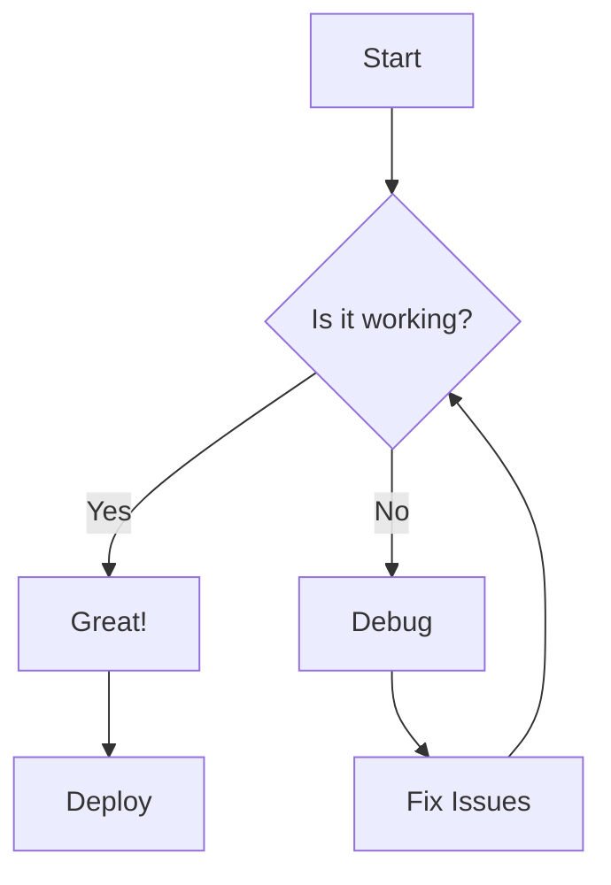
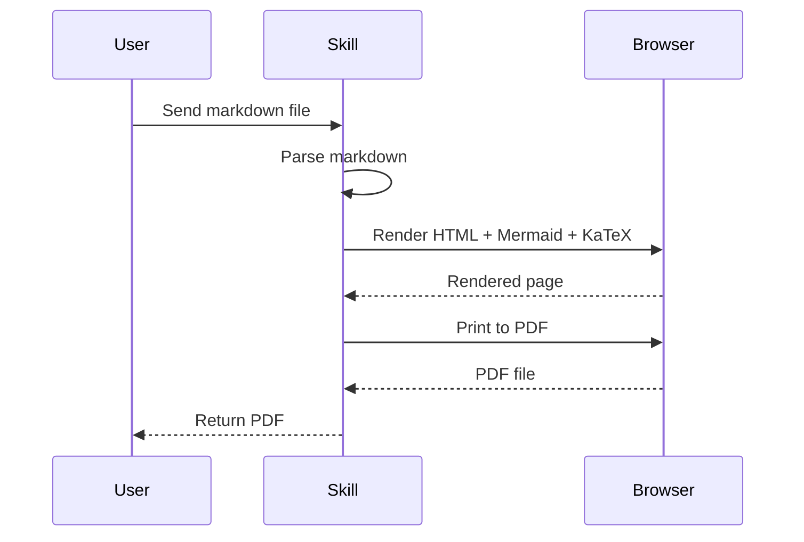

# Md2pdf Skill Test Document

This document tests all features of the **md2pdf** skill.

---

## 1. Math with KaTeX

Inline math: $E = mc^2$

Block math:

$$
\int_{-\infty}^{\infty} e^{-x^2} dx = \sqrt{\pi}
$$

Matrix example:

$$
\begin{pmatrix}
a & b \\
c & d
\end{pmatrix}
\begin{pmatrix}
x \\
y
\end{pmatrix}
=
\begin{pmatrix}
ax + by \\
cx + dy
\end{pmatrix}
$$

---

## 2. Mermaid Diagrams

### Flowchart



### Sequence Diagram



---

## 3. Code Blocks

```python
def hello_world():
    print("Hello from md2pdf!")
    return 42

# Math in comments: x^2 + y^2 = z^2
result = hello_world()
```

```javascript
// Browser rendering with Puppeteer
const pdf = await page.pdf({
    format: 'A4',
    printBackground: true
});
```

---

## 4. Tables

| Feature | Status | Notes |
|---------|--------|-------|
| Markdown parsing | ✅ | GitHub-flavored |
| Mermaid diagrams | ✅ | Auto-rendered |
| KaTeX math | ✅ | Inline & block |
| Syntax highlight | ✅ | Code blocks |
| Page numbers | ✅ | Footer |

---

## 5. Blockquotes

> "The best way to predict the future is to invent it."
> — Alan Kay

---

## 6. Task Lists

- [x] Create skill structure
- [x] Implement markdown parsing
- [x] Add Mermaid support
- [x] Add KaTeX support
- [x] Style with CSS
- [x] Generate PDF with Puppeteer

---

*Generated by md2pdf skill* 🐾
